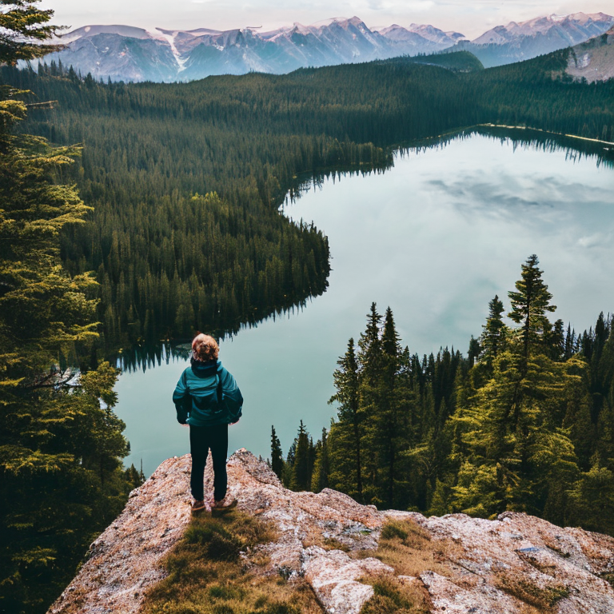
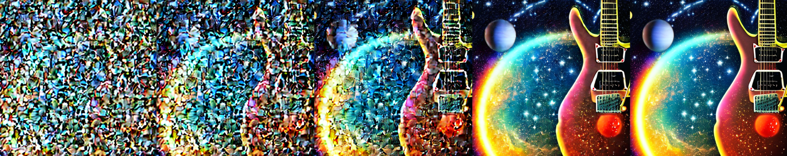
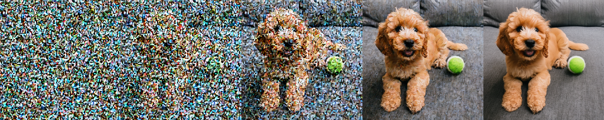
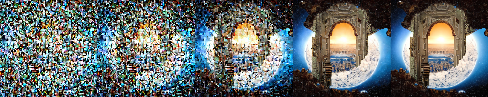
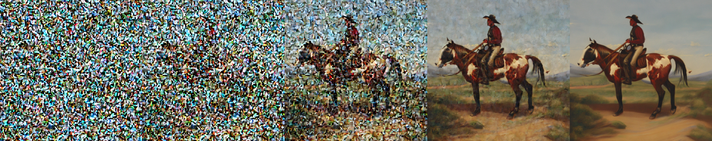
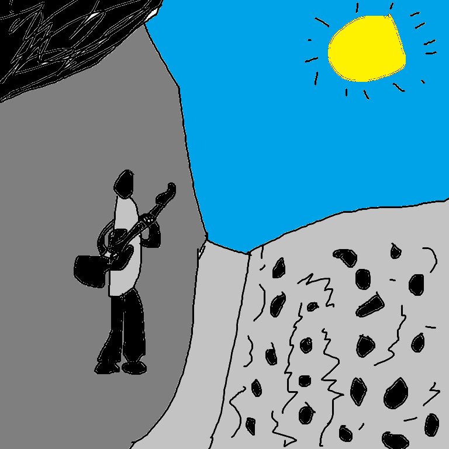
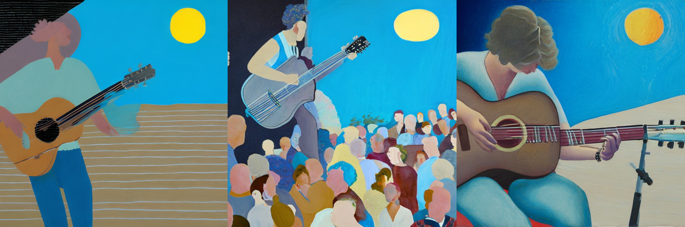

# Album Artwork Generator
This is a notebook for using Stable Diffusion Hugging Face (HF) Pipelines to generate and manipulate album artwork for musicians.

Some of this code was adapted from [Practical Deep Learning For Coders](https://course.fast.ai/) (Jeremy Howard @ fast.ai).

## Motivation
As a musician, I often have ideas for artwork that I want to release with my music, but I lack the time and experience to be able to achieve my vision. And as a hobbyist, I don't always have the financial resources to hire a professional to help me in this endeavor. With the advent and open-sourcing of [Stable Diffusion](https://stability.ai/stablediffusion) (among other generative models), it is now possible to generate incredible artwork from a basic text prompt and perform other image manipulations not previously possible. While other models, such as [DALL-E 2](https://openai.com/dall-e-2) and [Midjourney](https://www.midjourney.com/home/) can also create incredible artwork, this notebook is built with Stable Diffusion because of the open-source code and models.

I chose to utilize [HF Diffuser Pipelines](https://huggingface.co/docs/diffusers/index) because they offer an easy way to utilize various Stable Diffusion models for inference with little code.

A downside to these open-source models is that they are limited in resolution (Stable Diffusion 2.1 @ 768x768 px). This is not quite high enough to comfortably use as a cover art image. So a key piece of this notebook was to be able to produce high enough resolution images that I would be comfortable using them with my own music. I included the Stable Diffusion 4x upsampler to achieve this. And while it can only upsample from 512x512 --> 2048x2048 on 16GB VRAM (my typical minimum cover art requirement resolution is 3000x3000), this is high enough for the time being. Note that if you have more VRAM, you can increase the upscaling resolution.

The purpose of this project was to create a straightforward notebook that I could use to experiment with these new models without being restricted to a GUI, limited in the number of images I can generate, or having to pay a monthly fee. There are many Stable Diffusion notebooks currently available, but I wanted something that was concise and served my specific needs without extra descriptions, functionality, or examples. This project can be set up and run on any Linux system with only a few lines of code, or alternatively, simply installed/run directly from the notebook.

Because I have found these tools useful and simple to use, I decided to share them publically for anyone in a similar scenario. Of course, this notebook does not only have to be used for album artwork, as the functionality is generic, but that was the original intent.

This notebook consists of the following functionalities:
|Function|Resolution (px)|Description|
|---|---|---|
|Text to Image Generation|768x768|Generate images from a text prompt|
|Upscale Images|512x512 --> 2048x2048|Upscale images to increase resolution (upscaling higher resolution images requires more GPU VRAM)|
|Stepped Image Generation|768x768|Visualize various steps of the diffusion process|
|Image to Image Generation|768x768|Generate images from a text prompt and condition on an input image|
|Image Resizing Utility (no diffusion)|Any|Simple image resizing utility that does not affect the resolution of the image|

---

## Setup
**Requirements**
- CUDA-capable GPU with minimum 16GB VRAM, [CUDA toolkit](https://developer.nvidia.com/cuda-toolkit) installed
- Linux OS (Ubuntu used in steps below)
- [Anaconda](https://www.anaconda.com/) or [Miniconda](https://docs.conda.io/en/latest/miniconda.html)

#### Step 1 - Install Anaconda
Anaconda or Miniconda must be installed. If this has already been installed, skip step 1. Run the following command to install Miniconda:

```bash
wget https://repo.anaconda.com/miniconda/Miniconda3-latest-Linux-x86_64.sh
bash Miniconda3-latest-Linux-x86_64.sh
```

#### Step 2 - Set up Environment
Run the following line from the command line to create the appropriate environment to work with this notebook:

```bash
conda env create -f environment.yml
conda activate sd-album-art
```

The first line will set up a conda environment and install all of the necessary pip dependencies. The second line with activate the newly created environment.

#### Step 3 - Create Jupyter Kernel
With the `sd-album-art` environment active, run the following line to set up a Jupyter kernel:

```bash
python -m ipykernel install --user --name sd-album-art --display-name "sd-album-art (Python 3.9)"
```

Once the kernel has been installed, open the `sd-album-art.ipynb` notebook to begin generating artwork. Make sure that the `sd-album-art (Python 3.9)` kernel is active before running any cells.

---

## Examples Images

### Text to Image
<div align="center">
    
</div>

<br />

### Upscaled Image
<div align="center">
    
</div>

<br />

### Stepped Images
<div align="center">
    
    
    
    
</div>

<br />

### Image to Image
<div align="center">
    <b>Input</b><br>
    <br>
    <b>Output</b><br>
    
</div>

<br />
